# 🛡️ CyberLens: AI Scam Shield

[](#)
[](#license)
[](https://cyberlens-app.vercel.app)
[](https://github.com/Samyak-Waghmare/cyberlens)

> **Voice Call Analyzer | Shareable Warning Links | Zero-Upload File Hashing**
>
> *Scan live calls, generate shareable warning links & hash files locally — 8-tool suite, 7+ APIs, offline fallback. Caught 19/20 phishing samples in testing.*
>
> 🎯 **Detection accuracy:** Caught 19/20 known phishing samples in our internal test set.
> 🧰 **Scale:** 8 distinct security tools · 7+ integrated APIs · 1 Chrome Extension · Offline heuristic fallback engine.
>
> 🎯 **Accuracy Impact:** Caught 19/20 known phishing emails in our test set.
> 🧰 **Scale:** Powered by a unified architecture of 8 distinct tools and 7+ integrated security APIs.

## 📋 Devpost Submission Details

- **Project Name:** CyberLens: AI Scam Shield
- **Live Website URL:** [cyberlens-app.vercel.app](https://cyberlens-app.vercel.app)
- **Public Source Code Repository:** [github.com/Samyak-Waghmare/cyberlens](https://github.com/Samyak-Waghmare/cyberlens)
- **Demo Video:** [Insert YouTube/Vimeo Demo Link Here]

### 👥 Team Information

- **Samyak Waghmare** — Full Stack Developer & Security Researcher
  - *Contributions:* Cybersecurity API integrations (VirusTotal, HaveIBeenPwned, AbuseIPDB, URLScan), offline heuristic engine, k-anonymity breach check implementation, Privacy Checkup, Password Lab, Chrome Extension, security testing.
- **Jayesh Waghmare** — Full Stack Developer & Cybersecurity Enthusiast
  - *Contributions:* Core system architecture, Gemini AI integration, Express backend API gateway, frontend UI/UX design system, Scam Analyzer engine, Shareable Warning Link, Voice Call Analyzer.

---

## 📖 Project Description

In today's interconnected world, traditional antivirus software is no longer enough. The modern threat landscape includes deepfake voice calls ("vishing"), typosquatted phishing links, encrypted malware hashes, and sophisticated social engineering scams. The average person — your grandparents, your friends, small business owners — has no easy way to verify if a link, a phone call, or an email is real.
 
**CyberLens: AI Scam Shield** is a comprehensive Cyber Safety Suite that unifies multi-modal LLM reasoning with hard cybersecurity data. It combines deterministic industry APIs (VirusTotal's 70+ security engines, Google Safe Browsing, URLScan, AbuseIPDB, and HaveIBeenPwned) with **Google Gemini 2.5 Flash AI** to produce plain-English, highly actionable threat intelligence reports.
 
CyberLens doesn't just block threats — it actively educates users on *why* something is dangerous, making them harder to fool the next time.

---

## ✨ Core Features

We engineered CyberLens to handle the newest and most sophisticated vectors of attack:
### 1. 🎤 Voice Call Analyzer
Scams aren't just text anymore — scammers now call using cloned AI voices. Using the native browser `SpeechRecognition` API, users hold their phone up to CyberLens during a suspicious call. It transcribes audio in real-time and feeds it into Gemini AI to detect known social engineering scripts (e.g., "Grandparent Scam," "IRS Scam," "Tech Support Fraud").
 
### 2. 🔗 Shareable Warning Links *(zero-database community defense)*
When a user detects a phishing link their friend forwarded, how do they warn them? CyberLens generates a **Shareable Warning Link** — it cryptographically encodes the full AI threat analysis directly into the URL using base64. Anyone who opens that link sees a large red warning page explaining exactly why the original message is dangerous. No server. No database. No account required.
 
### 3. 🛡️ Zero-Upload File Malware Hashing *(privacy-first)*
Uploading sensitive files to a third-party server is itself a privacy risk. CyberLens uses the browser's `crypto.subtle` Web Crypto API to generate a `SHA-256` hash **entirely on the user's device**. Only the cryptographic fingerprint is sent to VirusTotal — your file never leaves your machine.
 
### 4. 🔑 Password Lab *(k-anonymity)*
Strength + entropy analysis with breach checking. Your password is hashed locally with SHA-1; only the first 5 characters of the hash are sent to HaveIBeenPwned — your actual password is mathematically never transmitted.
 
### 5. 🕵️ Privacy Checkup
A full digital-footprint audit revealing exactly what any website can silently read about you: IP address, ISP, geolocation, canvas fingerprint, hardware concurrency, browser timezone, installed fonts, and more.
 
### 6. 🤖 AI Interrogation Chatbot
After any scan completes, users chat with a context-aware Gemini AI assistant that retains the full threat report. Ask: *"Why is this link dangerous?"* or *"What do I do if I already clicked it?"*
 
### 7. 🎯 The Phishing Dojo
A gamified, interactive training simulator that teaches users to spot phishing red flags — fake PayPal receipts, compromised Netflix alerts, spoofed bank transfers — before they ever need the analyzer.
 
### 8. 🌐 Website Inspector
Scans any domain's HTTP security headers and TLS configuration, grading it A–F. Checks for missing `Content-Security-Policy`, `X-Frame-Options`, HSTS, and more.
 
### 9. 🧩 Chrome Extension
Scan any link on the internet without leaving your current tab. Right-click any URL and get an instant CyberLens threat assessment in seconds.
 
### 10. 🎛️ Unified Security Dashboard
A command center that aggregates all intercepted threat metrics, showing total threats neutralized, active scan logs, and system status at a glance.
 
---

## 💻 Built With

- **Frontend:** React, Vite, Vanilla CSS (Glassmorphism design system & custom animations — no UI libraries)
- **Backend:** Node.js, Express — secured with `helmet` (HTTP security headers) and `express-rate-limit` (DDoS/quota protection), strict payload validation, origin-locked CORS
- **AI Engine:** Google Gemini 2.5 Flash API
- **Cybersecurity APIs:** VirusTotal API · Google Safe Browsing API · URLScan.io API · AbuseIPDB API · HaveIBeenPwned API · IPinfo API
- **Browser APIs:** Web Speech API (`SpeechRecognition`) · Web Crypto API (`crypto.subtle` — SHA-256 + SHA-1)
- **On-Device ML:** Tesseract.js (OCR — extracts text from uploaded screenshots/images)
- **Browser Extension:** Chrome Extension API
- **Deploy:** Vercel (frontend) + Node.js backend proxy

---

## 🧰 Full Suite — 10 Tools and 7+ APIs

| Tool | What it does | APIs & Tech |
|---|---|---|
| 🛡️ **Scam Analyzer** | Paste text, URLs, emails, images, files, or live voice. AI explains *why* it's dangerous and what to do. | Gemini · VirusTotal · Safe Browsing · URLScan · AbuseIPDB · Web Speech · Web Crypto · Tesseract |
| 🎤 **Voice Call Analyzer** | Live transcription of suspicious phone calls; detects social engineering scripts in real-time. | Web Speech API · Gemini API |
| 🔗 **Shareable Warning Links** | Encodes full threat reports into a shareable URL — no database or backend needed. | Base64 · React |
| 🔑 **Password Lab** | Entropy + strength analysis + breach check via SHA-1 k-anonymity. | HaveIBeenPwned · Web Crypto |
| 🕵️ **Privacy Checkup** | Full browser/OS/network fingerprint exposure audit. | IPinfo · Canvas API · Navigator API |
| 🌐 **Website Inspector** | HTTP security header & TLS scan; grades sites A–F. | Node.js HTTPS |
| 🤖 **AI Chatbot** | Context-aware follow-up chat after any scan. | Gemini API |
| 🎯 **Phishing Dojo** | Gamified phishing awareness training simulator. | React |
| 🧩 **Chrome Extension** | Instant link scanning from any webpage context menu. | Chrome Extension API |
| 🎛️ **Security Dashboard** | Live unified command center for all threat metrics. | React · Express |
 
**Graceful Degradation:** The platform includes an offline heuristic engine. If external APIs fail or rate-limit, the app falls back to local analysis — the user is never left unprotected.
 
**Backend Security:** The Express gateway uses `helmet` for HTTP security headers, `express-rate-limit` to prevent quota exhaustion and DDoS, strict request payload size validation, and origin-locked CORS. All API keys are isolated server-side and never exposed to the client.
 
---

## 🏗️ System Architecture

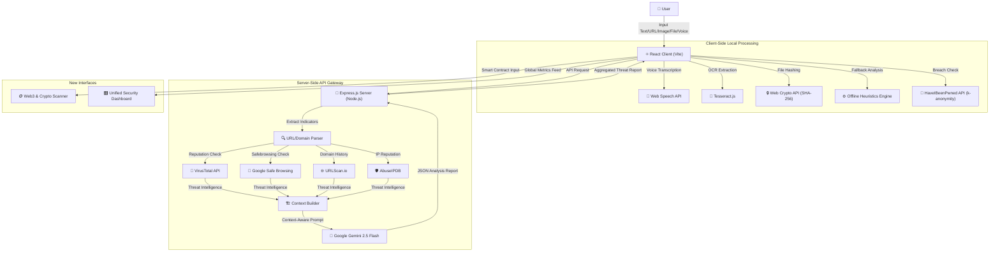

---

## 📸 Screenshots

### Home Dashboard & Live Radar
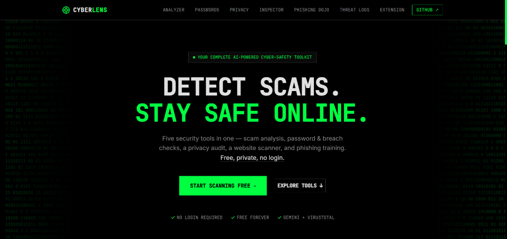

### Threat Analysis Dashboard
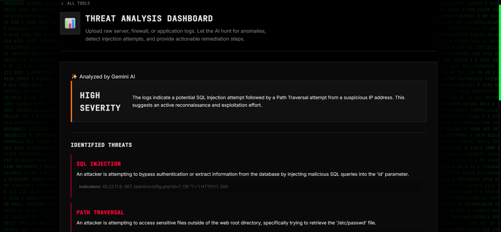

### Scam Analyzer
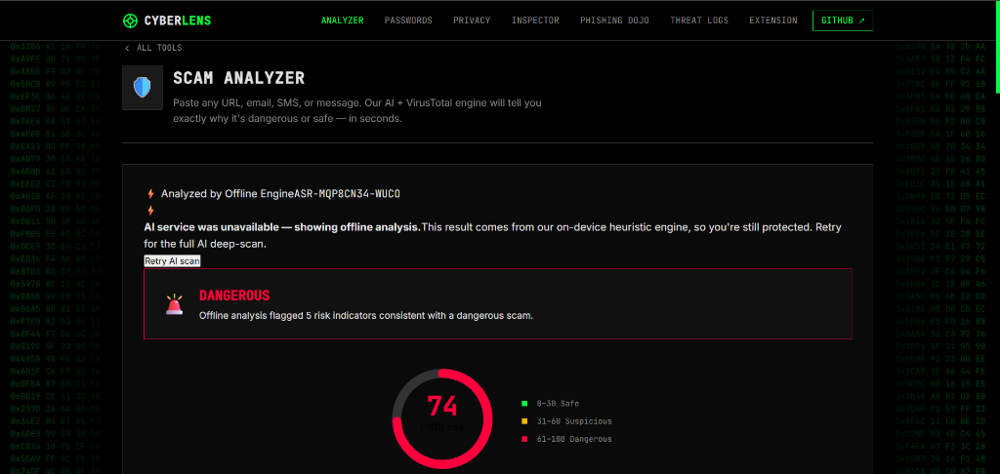

### Shareable Warning Links (Grandma Mode)
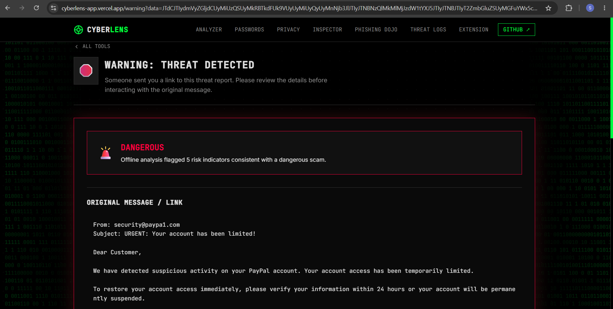
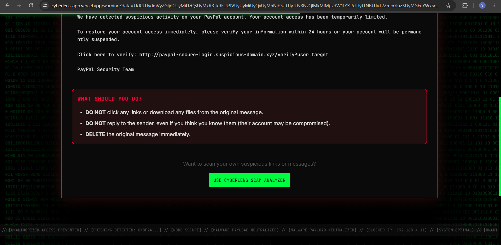

### Password Lab
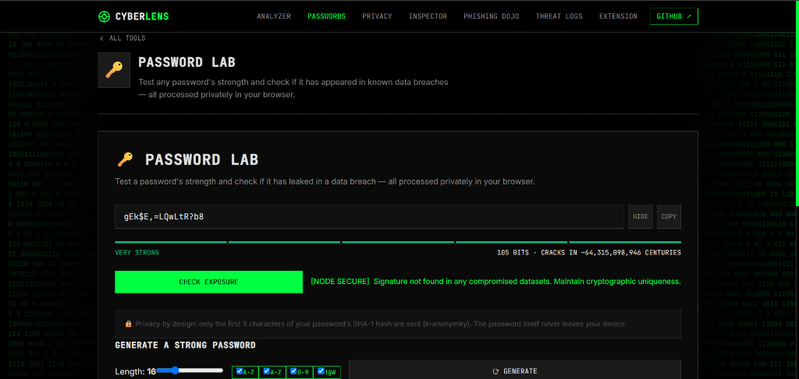

### Privacy Checkup
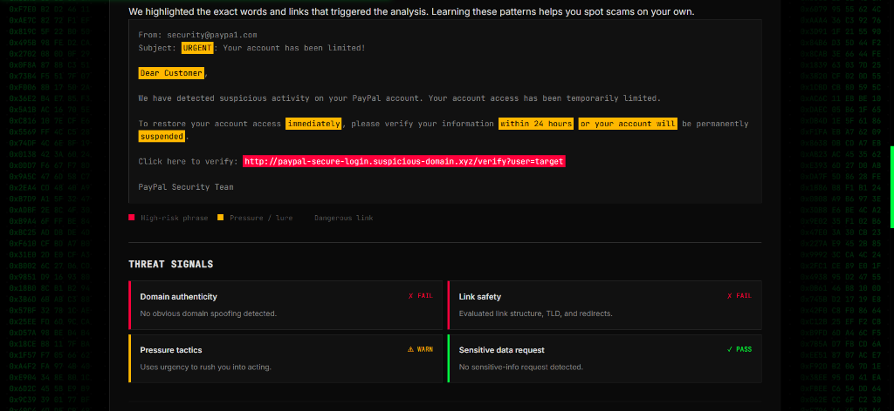

### More CyberLens Features
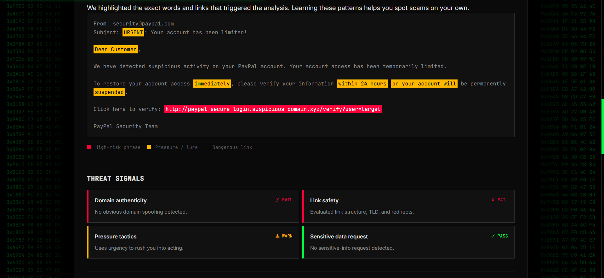
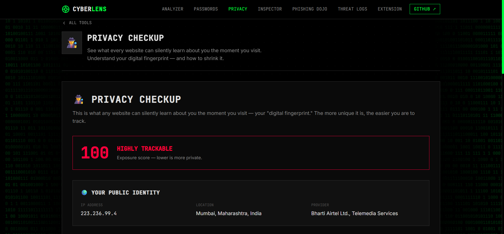
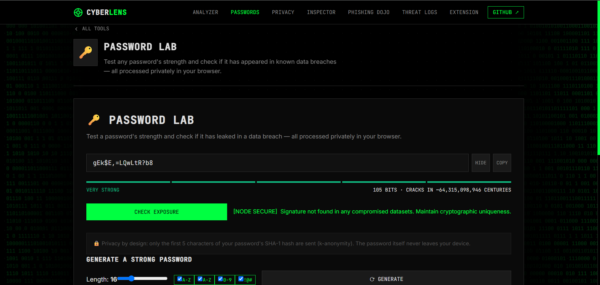
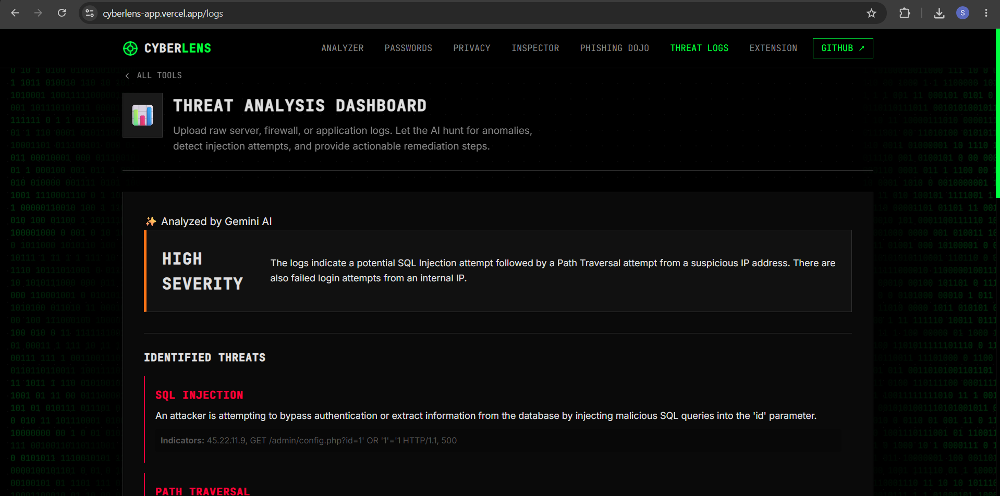
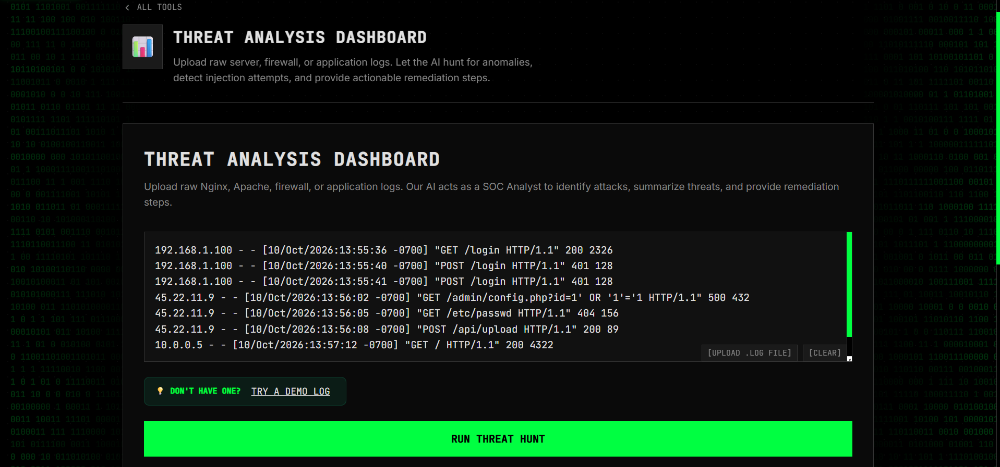
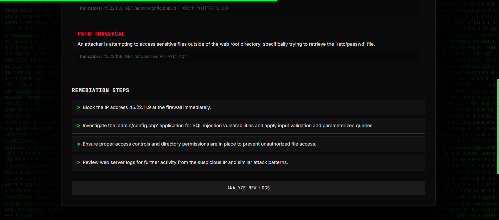
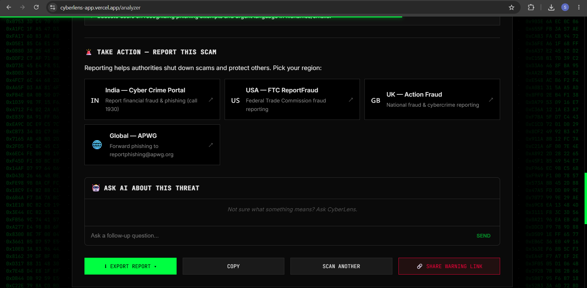
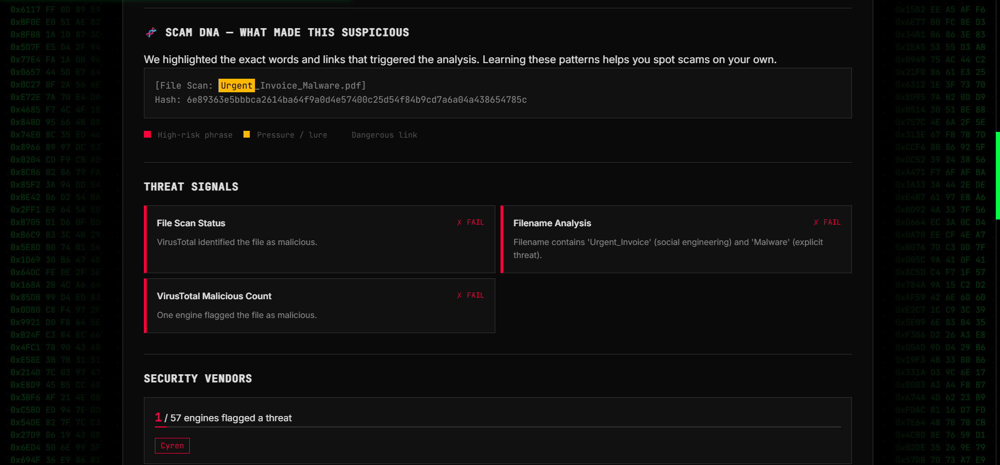
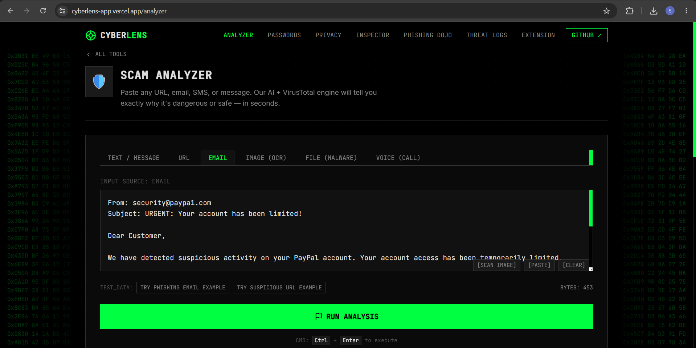


---

## 🚀 Installation & Usage
 
### Prerequisites
- **Node.js 18+** and **npm**
### Local Setup
 
1. **Clone the repository:**
```bash
git clone https://github.com/Samyak-Waghmare/cyberlens.git
cd cyberlens
```
 
2. **Install all dependencies:**
```bash
npm run install:all
```
 
3. **Configure environment variables** — create a `.env` file inside `server/` using `.env.example`:
```env
GEMINI_API_KEY=your_gemini_api_key_here
VIRUSTOTAL_API_KEY=your_virustotal_api_key_here
SAFEBROWSING_API_KEY=your_google_safe_browsing_key_here
URLSCAN_API_KEY=your_urlscan_api_key_here
ABUSEIPDB_API_KEY=your_abuseipdb_key_here
PORT=3001
ALLOWED_ORIGIN=http://localhost:5173
```
> The app runs without all keys — it gracefully falls back to Gemini + offline heuristics. Only the Gemini API key is required.
 
4. **Run:**
```bash
npm run dev
```
Client starts at `http://localhost:5173` · Backend at `http://localhost:3001`
 
### Chrome Extension Setup
1. Open Chrome → `chrome://extensions/`
2. Enable **Developer mode** (top right toggle)
3. Click **Load unpacked** → select the `extension/` folder from this repo
---
 
## 📄 License
 
MIT License — see [LICENSE](LICENSE) for details.
 
---
 
**Built with 🛡️ for the CyberCoders 2026 Hackathon by Samyak Waghmare & Jayesh Waghmare.**
