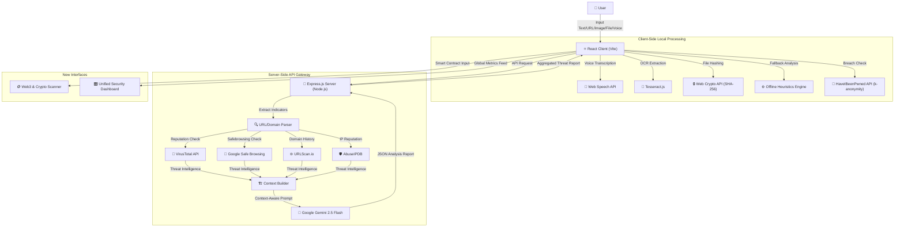

# 🛡️ CyberLens (AI Scam Shield)

[](#)
[](#license)
[](https://cyberlens-app.vercel.app)
[](https://github.com/Samyak-Waghmare/cyberlens)

> **Detect scams. Defeat deepfakes. Protect your network.**

*The ultimate all-in-one Cyber Safety Suite built for the CyberCoders 2026 Hackathon.*

## 📋 Devpost Submission Details

- **Project Name:** CyberLens
- **Live Website URL:** [cyberlens-app.vercel.app](https://cyberlens-app.vercel.app)
- **Public Source Code Repository:** [github.com/Samyak-Waghmare/cyberlens](https://github.com/Samyak-Waghmare/cyberlens)
- **Demo Video:** [Insert YouTube/Vimeo Demo Link Here]

### 👥 Team Information
- **Samyak Waghmare** - Full Stack Developer & Security Researcher
  - *Contributions:* Integration of cybersecurity APIs (VirusTotal, HaveIBeenPwned), offline heuristic logic, security testing, and implementation of the Privacy Checkup and Password Lab tools.
- **Jayesh Waghmare** - Full Stack Developer & Cybersecurity Enthusiast
  - *Contributions:* Core system architecture, AI/Gemini integration, backend API development, frontend UI/UX design, and the Scam Analyzer engine.

---

## 📖 Project Description

In today's interconnected world, traditional antivirus software is no longer enough. The modern threat landscape includes deepfake voice calls ("vishing"), typosquatted phishing links, encrypted malware hashes, and sophisticated social engineering scams. The average person has no easy way to verify if a link, a phone call, or an email is a threat.

**CyberLens** is a comprehensive **Cyber Safety Suite** that unifies multi-modal LLM reasoning with hard cybersecurity data. It combines deterministic industry APIs (including VirusTotal's 70+ security engines, Google Safe Browsing, URLScan, AbuseIPDB, and HaveIBeenPwned) with **Google's Gemini 2.5 Flash AI** to produce plain-English, highly actionable threat intelligence reports. 

CyberLens doesn't just block threats; it actively educates users on *why* something is dangerous, making them harder to fool the next time.

---

## ✨ Core Features

We engineered CyberLens to handle the newest and most sophisticated vectors of attack:

### 1. 🎤 Voice Call Analyzer
Scams aren't just text anymore; scammers call your phone using cloned AI voices. Using the native browser `SpeechRecognition` API, users can hold their phone up to CyberLens during a suspicious call. It instantly transcribes the audio and feeds it into our Gemini AI to detect if the caller is running a known social engineering script (e.g., the "Grandparent Scam" or "IRS Scam").

### 2. 🔗 Shareable Warning Links
The best defense is community defense. If a user detects a phishing link that their friend forwarded them, how do they warn them? We built a zero-database Shareable Warning Link feature. It cryptographically encodes the AI threat analysis directly into the URL (base64). Victims can send a link back to their friend that opens a massive RED warning page explaining exactly why the original message is dangerous.

### 3. 🛡️ Zero-Upload File Malware Hashing
Uploading sensitive PDFs or Executables to a third-party server to check for malware is a massive privacy risk. CyberLens uses the browser's `crypto.subtle` API to generate a `SHA-256` hash entirely locally on the user's device. We only send the cryptographic signature to VirusTotal to check for known malware.

### 4. 🤖 AI Interrogation Chatbot
A static report isn't always enough. When a threat scan completes, users can chat directly with an AI assistant that retains the context of the threat report. Users can ask follow-up questions like: *"Why is this link dangerous?"* or *"What should I do if I already clicked it?"*

### 5. 🎯 The Phishing Dojo
CyberLens is proactive, not just reactive. We built a fully interactive, gamified simulator that trains users to spot the tell-tale signs of a scam (fake PayPal receipts, compromised Netflix accounts) before they even need to use our analyzer.

### 6. 🪙 Web3 & Crypto Honeypot Scanner
Crypto scams are financially devastating. CyberLens includes a simulated Web3 security auditor that decompiles smart contract bytecode and detects honeypot traps, rug pulls, and hidden mint functions before users connect their wallets.

### 7. 🎛️ Unified Security Dashboard
A global command center that aggregates all threat metrics into a stunning, live-updating interface. It provides users with an instant snapshot of their system status, total threats neutralized, and a scrolling feed of recent intercepts.

---

## 💻 Built With

CyberLens was built entirely from scratch for the CyberCoders 2026 Hackathon using:
- **Frontend**: React, Vite, Vanilla CSS (Glassmorphism & Custom Animations)
- **Backend**: Node.js, Express
- **AI Engine**: Google Gemini 2.5 Flash API
- **Cybersecurity Data**: VirusTotal API, Google Safe Browsing API, URLScan API, AbuseIPDB API, HaveIBeenPwned API, IPinfo API
- **Native Browser APIs**: Web Speech API (`SpeechRecognition`), Web Crypto API (`crypto.subtle`)
- **Other Intelligence**: Tesseract.js (On-Device OCR Engine)

---

## 🧰 Full Suite Capabilities

| Tool | Implementation & Features | APIs & Tech Used |
|------|-------------|------------------|
| 🛡️ **Scam Analyzer** | Paste Text, URLs, Emails, Images, Files, or Voice Calls. AI explains *why* it's dangerous. | `Gemini API`, `VirusTotal`, `Google Safe Browsing`, `URLScan`, `AbuseIPDB`, `Web Speech`, `Web Crypto`, `Tesseract OCR` |
| 📡 **Live Scam Radar** | A real-time global dashboard feed streaming anonymized threat intercepts. | `Express`, `React` |
| 🔑 **Password Lab** | Strength + entropy analysis. Checks known data breaches using SHA-1 k-anonymity. | `HaveIBeenPwned API`, `Web Crypto` |
| 🕵️ **Privacy Checkup** | A digital-footprint audit showing the fingerprint websites can silently read. | `IPinfo API`, `Canvas/Navigator API` |
| 🌐 **Website Inspector** | A security-header & TLS vulnerability scan of any site, grading it **A–F**. | `Node.js HTTPS` |
| 🪙 **Web3 Scanner** | Simulates blockchain auditing to check smart contracts for honeypot traps and locked liquidity. | `React`, `Simulated Web3` |
| 🧩 **Chrome Extension** | Scan any link on the internet instantly without leaving your current tab. | `Browser Extension API` |
| 🎛️ **Security Dashboard** | A unified command center providing live global threat metrics and system status. | `React`, `CSS Glassmorphism` |

**Graceful Degradation:** The platform features an offline heuristic engine. If external APIs fail or rate-limit, the app degrades to local analysis, ensuring the user is never left unprotected.

---

## 🏗️ System Architecture



---

## 📸 Screenshots

### Home Dashboard & Live Radar


### Threat Analysis Dashboard


### Scam Analyzer


### Shareable Warning Links (Grandma Mode)


### Password Lab


### Privacy Checkup


### More CyberLens Features


---

## 🚀 Installation and Usage Instructions

### Prerequisites
- **Node.js 18+** and **npm**

### Local Setup
1. **Clone the repository:**
   ```bash
   git clone https://github.com/Samyak-Waghmare/cyberlens.git
   cd cyberlens
   ```

2. **Install dependencies:**
   ```bash
   npm run install:all
   ```

3. **Configure Environment Variables:**
   Create a `.env` file inside the `server/` directory using `.env.example` as a template:
   ```env
   GEMINI_API_KEY=your_gemini_api_key_here
   VIRUSTOTAL_API_KEY=your_virustotal_api_key_here
   SAFEBROWSING_API_KEY=your_google_safe_browsing_key_here
   URLSCAN_API_KEY=your_urlscan_api_key_here
   ABUSEIPDB_API_KEY=your_abuseipdb_key_here
   PORT=3001
   ALLOWED_ORIGIN=http://localhost:5173
   ```
   *(Note: The app will run without external intelligence keys by gracefully falling back to AI and offline heuristics, but Gemini is required).*

4. **Run the Application:**
   ```bash
   npm run dev
   ```
   The client will start at `http://localhost:5173` and proxy API requests to the Express server at `http://localhost:3001`.

---

**Built with 🛡️ for the CyberCoders 2026 Hackathon.**
